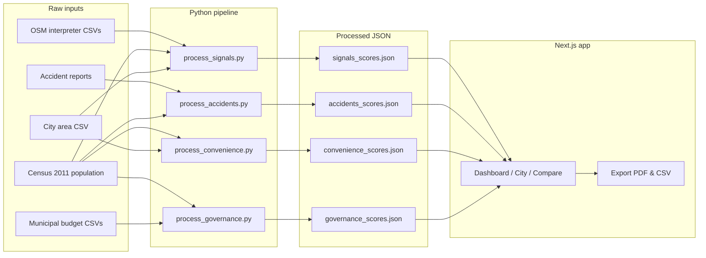

# Neural City


**Neural City** is a proof-of-concept dashboard for comparing Indian cities on street-level outcomes. It layers public secondary data (OpenStreetMap, municipal budgets, road safety reports, Census 2011) into normalized scores across **Safety**, **Convenience**, and **Governance**, then surfaces rankings, city profiles, head-to-head comparisons, and **exportable PDF/CSV reports** with shareable links.

Live demo: [midaksh-neural-city.vercel.app](https://midaksh-neural-city.vercel.app)

---

## Introduction

Indian cities are rarely evaluated on comparable, street-facing signals using open data alone. Neural City tests whether we can build a repeatable pipeline from messy CSV inputs to a clean dashboard: Python scripts normalize raw metrics into JSON artifacts, and the Next.js app lets users explore city rankings, drill into a single city, compare two cities side by side, and export findings for meetings or sharing.

This prototype covers **11 cities** (alphabetical): Ahmedabad, Bengaluru, Chennai, Delhi, Gurgaon, Hyderabad, Indore, Lucknow, Mumbai, Surat, and Vizag.

---

## Features

| Feature | Route | Description |
|---------|-------|-------------|
| **Overview & rankings** | `/` | Sortable table across Safety, Convenience, Governance, and Overall scores |
| **City profiles** | `/city`, `/city/[id]` | Full drill-down: pillar scores, accident breakdown, transport mix, budget timeline |
| **Compare cities** | `/compare` | Head-to-head comparison with category charts; shareable URL (`?a=…&b=…`) |
| **Export & share** | Header (city profile & compare results) | Download branded **PDF** or structured **CSV**; copy page URL to clipboard |
| **Data sources** | `/data-sources` | Links to GitHub repo and project documentation |

**Export & share** appears in the header when viewing a city profile or comparison results. PDF exports include the Neural City logo, sectioned tables, and contact footer; CSV exports mirror the same structure for Excel/Sheets.

---

## System design



**Flow:** raw CSVs are processed by custom Python scripts into scored JSON files under `data/processed/` and `public/data/`. The Next.js app imports these at build time and renders rankings, city detail pages, compare views, and client-side PDF/CSV exports.

---

## Tech stack

| Layer | Technology | Role |
|-------|------------|------|
| Frontend | Next.js 16 (App Router) | Routing, SSR/SSG, city pages |
| UI | React 19, Tailwind CSS 4 | Components and styling |
| Motion | Framer Motion | Page and chart animations |
| Export | jsPDF, jspdf-autotable | Branded PDF reports from city/compare views |
| Icons | Lucide React | Navigation and section icons |
| Language | TypeScript | Type-safe app code |
| Data pipeline | Python 3 (stdlib only) | Score normalization scripts — `csv`, `json`, `math`, `pathlib`, `dataclasses`, `glob`, `statistics` |
| Storage | JSON (static) | Processed scores served from `public/data/` |
| Deploy | Vercel | Hosted prototype |

---

## Data sources

| Dataset | Location | Used for |
|---------|----------|----------|
| OpenStreetMap signals & signs | `data/raw/safety/signals-and-signs/*/interpreter.csv` | Safety infrastructure scores |
| Road accident reports | `data/raw/safety/accidents/` | Safety harm scores |
| OpenStreetMap public transport | `data/raw/convenience/*/interpreter.csv` | Convenience scores |
| Municipal spending / budget | `data/raw/governance/*/` | Governance scores |
| Census 2011 population | `data/raw/population-data.csv` | Per-capita normalization |
| City area (km²) | `data/raw/india_cities_area.csv` | Density metrics |

Processed outputs land in `public/data/*.json` and are consumed by the dashboard.

---

## Methodology

Scores are normalized to **0–100** across the 11-city cohort. Bands: **Poor** (0–35), **Manageable** (35–65), **Good** (65+).

### 1. Safety: Infrastructure (signals & signs)

**Script:** `scripts/process_signals.py`

| Step | Logic |
|------|--------|
| Count | Sum traffic signals, stop signs, crossings, and traffic calming from OSM CSVs |
| Raw metrics | Infrastructure per 100k population; traffic signals per km² |
| Normalize | Sqrt-compress each metric, min–max scale to 0–100 |
| Composite | Average of per-capita and density sub-scores |

### 2. Safety: Accidents

**Script:** `scripts/process_accidents.py`

| Step | Logic |
|------|--------|
| Harm score | `deaths×10 + injuries×3 + incidents×1` |
| Danger rate | Harm score per 100k residents |
| Severity | Deaths / (deaths + injuries) |
| Raw composite | `danger_rate×0.65 + severity×100×0.35` |
| Final score | Invert sqrt(raw): higher = safer; outliers calibrated to cohort median |

Annualization rules vary by city (e.g. Hyderabad uses 2025 total row, Surat averages 2022–2023).

### 3. Convenience (public transport)

**Script:** `scripts/process_convenience.py`

| Step | Logic |
|------|--------|
| Weighted stops | `bus×1.0 + railway×6.25 + metro×4.0` (catchment-radius weighting) |
| Spatial | Weighted stops / city area (km²) |
| Access | Weighted stops per 100k population |
| Normalize | Sqrt-compress, scale 15–100 per sub-score |
| Composite | `spatial×0.55 + access×0.45` |

### 4. Governance (municipal budgets)

**Script:** `scripts/process_governance.py`

| Step | Logic |
|------|--------|
| Spend ratio | Distance from spending/budget ratio = 1.0; asymmetric penalty for overspend |
| Invest | `latest_spending_rupees ÷ population` = **₹ per resident** (not per 100k); sqrt-scaled across cohort |
| Composite | `spend_ratio×0.60 + invest×0.40` |

### 5. Pillar & overall scores (app layer)

| Pillar | Composite rule |
|--------|----------------|
| Safety | Average of infrastructure + accident scores |
| Convenience | From convenience JSON composite |
| Governance | From governance JSON composite |
| Overall | Mean of Safety + Convenience + Governance |

---

## How to run

### Prerequisites

- Node.js 20+
- Python 3.10+
- npm

### 1. Install dependencies

```bash
cd neural-city-project
npm install
```

### 2. Process data (optional if JSON already committed)

```bash
python scripts/process_signals.py
python scripts/process_accidents.py
python scripts/process_convenience.py
python scripts/process_governance.py
```

Each script writes to `data/processed/` and `public/data/`.

### 3. Start the dev server

```bash
npm run dev
```

### 4. Production build

```bash
npm run build
npm start
```

### 5. Lint

```bash
npm run lint
```

---

## Project structure

```
neural-city-project/
├── data/raw/           # Source CSVs
├── data/processed/     # Generated JSON (mirror of public/data)
├── public/data/        # JSON consumed by the app
├── scripts/            # Python scoring pipelines
└── src/
    ├── app/            # Next.js routes
    ├── components/     # UI components (dashboard, city-detail, compare, export)
    ├── context/        # ExportShareProvider
    ├── data/           # TypeScript data adapters
    └── lib/
        ├── export/     # PDF/CSV builders and download helpers
        └── ...         # Helpers and aggregators
```
---
